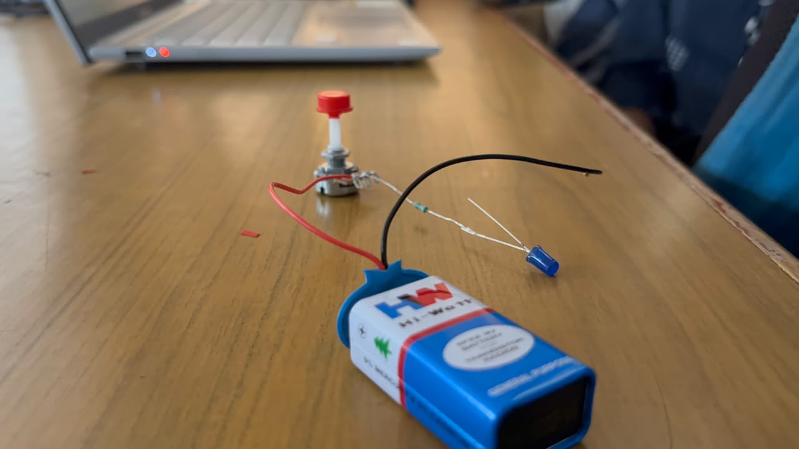

# LED BRIGHTNESS CONTROL USING POTENTIOMETER

# 1\. Product Use:

Used for adjustable lighting, LED control systems, electronic circuits and basic dimming applications.

# 2\. How We Made It:

We connected the potentiometer, LED, resistor and battery on a breadboard. We gave the required connections and tested the circuit by rotating the potentiometer to observe the change in LED brightness.

# 3\. Working:

Potentiometer rotated → Resistance changes → LED brightness changes  
Higher brightness → LED glows brighter  
Lower brightness → LED glows dimmer

# 4\. Conclusion:

This project helped us understand the working of a potentiometer, LED brightness control, resistance variation and proper breadboard connections. 

